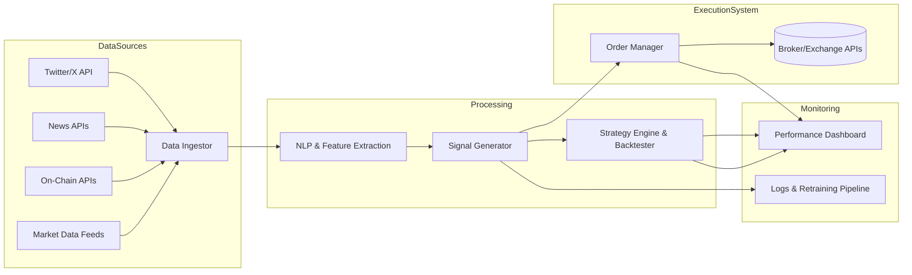
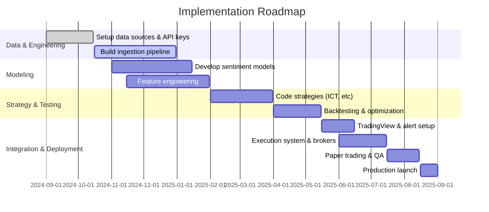

# AI-Driven Trading System — Design Document

> **Status:** Design proposal
> **Scope:** Multi-signal ingestion → NLP/sentiment modeling → strategy generation → backtesting → automated execution, with full risk, monitoring, security, and compliance controls.
>
> **Disclaimer:** This is an engineering design document, not financial or legal advice. Any live deployment must be reviewed by qualified legal/compliance counsel. All data sources described are public or licensed; the system trades only on public information and adheres to platform Terms of Service and applicable market regulations.

## Executive Summary

We propose an AI-driven trading system that ingests diverse market signals (social media, news, on-chain) and uses NLP and quantitative models to generate high-conviction trade ideas and automated execution. Key components include data sources (Twitter/X influencer feeds, crypto news sites, economic releases), real-time ingestion pipelines (leveraging official APIs or licensed data services), sentiment/hype modeling (BERT-based classifiers and statistical features), and backtested strategies (e.g. Inner Circle Trader methods, momentum, mean-reversion). Trading signals with explicit rationales are output as TradingView alerts (via Pine Script) and fed into an execution engine (broker APIs or exchanges) with full risk controls. Compliance with insider-trading laws and platform TOS is enforced by using only public data sources and adhering to rate limits. The system includes continuous monitoring, retraining, and security safeguards (key management, encryption). We present architecture diagrams, data schemas, model training pipelines, backtest plans, and example code. Tables compare API options (Twitter/X, news feeds, on-chain data), broker choices (stocks/futures/crypto), and ML models (text vs time-series), enabling informed design trade-offs.

## 1. Data Sources (Priority & Access)

Our system prioritizes **high-quality, authorized data feeds** to avoid legal/technical issues. Key sources include:

- **Crypto/Equity News APIs:** Licensed news services that provide market-moving content with metadata and sentiment. For example, **Tiingo** covers global stock/crypto/FX news with historical depth, **FinancialModelingPrep (FMP)** offers up-to-date financial news and trend analysis, and **Benzinga API** specializes in actionable, market-moving stories. **Finnhub** provides real-time aggregated headlines (from Bloomberg, Reuters, etc.) plus basic sentiment. A table of candidate news APIs:

  | Provider     | Coverage                      | Features                                | Access    |
  |--------------|-------------------------------|-----------------------------------------|-----------|
  | Tiingo       | Stocks, Crypto, FX            | Tagged sources, sentiment, long history | Paid/Free |
  | FMP          | Global stocks & crypto news   | Company & market news, trend context    | Free/Paid |
  | Benzinga     | Stocks, Crypto, Options news  | Real-time market-moving news, calendars | Paid      |
  | Finnhub      | Stocks, Forex, Crypto news    | Real-time headlines, source links       | Free/Paid |
  | NewsAPI.org  | General news (crypto section) | Broad coverage, free tier limits        | Free/Paid |
  | SEC Filings  | Official company releases     | Mandatory disclosures, fundamentals     | Public    |

- **Social Media (Twitter/X):** Public tweets by market influencers and "whale" accounts can be predictive. We follow *curated lists of crypto insiders* and finance commentators. Official **X API v2** is used to fetch tweets (user timelines or filtered search) in real time. For example, to retrieve a user's tweets:

  ```bash
  curl --request GET 'https://api.x.com/2/users/USER_ID/tweets' \
       --header 'Authorization: Bearer YOUR_TOKEN'
  ```

  (This returns recent tweet IDs and text by default.) We subscribe to accounts (e.g. known crypto analysts, blockchain game projects, on-chain analysts) via an enterprise API. Optionally, we may license aggregated crypto social data (e.g. a Twitter corpus provider) to access 5+ years of backfilled posts with sentiment.

- **On-Chain & Alternative Data:** Blockchain data providers (Glassnode, Santiment, CryptoQuant) supply signals like whale transfers or exchange flows. **Whale Alert** tweets large transactions (accessible via its API). **Google Trends** or **Reddit/Telegram** alerts (through APIs or webhooks) can supplement hype detection, though we rely on official endpoints where possible.

- **Market Data (Pricing & Fundamentals):** We ingest historical and live price feeds from exchange APIs and market data vendors. For futures markets (e.g. CME S&P 500 futures, crypto perpetuals), we use exchanges' REST/WebSocket or brokers (see Section 8). Fundamental/economic data (e.g. Fed announcements, economic calendar) come from providers like FRED or calendar APIs (e.g. FMP economic releases).

In summary, we prioritize **official and licensed APIs**: Twitter's developer API (with proper auth and rate-limit handling), reputable news APIs (Finnhub, Benzinga, Tiingo, etc.), and market data feeds. Web scraping is **avoided** (it violates platform TOS and risks bans). The below table summarizes key sources and access methods:

| Data Type       | Source/Account                   | Access Method                  | Notes                                             |
|-----------------|----------------------------------|--------------------------------|---------------------------------------------------|
| Tweets (crypto) | X (Twitter) API v2               | Official API (timeline/search) | Auth required, rate-limited; stable for live data |
| Tweets (macro)  | X API (finance feeds)            | Official API                   | e.g. Fed chairs, large traders                    |
| Sentiment Data  | Third-party (TheTie, Perception) | REST API                       | Pre-scored sentiment on tweets/news               |
| News Headlines  | Finnhub, Benzinga, Tiingo, FMP   | REST APIs                      | Provide headlines, source, sentiment tags         |
| News RSS/Atom   | Crypto news sites                | RSS feed (per TOS)             | e.g. CoinDesk, CoinTelegraph (subject to TOS)     |
| Whale Transfers | Whale Alert                      | REST API/Webhook               | Tracks large crypto txns                          |
| Blockchain Data | Glassnode, CryptoQuant           | REST API                       | On-chain metrics (volume, addresses, etc.)        |
| Price Data      | Exchange APIs (CCXT)             | REST/WebSocket                 | OHLC, order book for futures/crypto               |
| Economic Data   | FRED, ECB, FMP                   | REST API                       | GDP, CPI, interest rates, job figures             |

Each source has authentication (API keys, OAuth) and rate limits. We implement robust ingestion (exponential backoff, request throttling) and normalize formats (JSON → relational tables or NoSQL store). Preprocessing (see Section 2) tags data with timestamps, symbols, and initial sentiment where available.

## 2. Data Ingestion & Processing Pipeline

Data flows through a structured pipeline that cleans and enriches raw inputs into features. We ingest from multiple channels (Twitter, news APIs, on-chain feeds), then perform deduplication, ticker/entity resolution, and classification of events. This ensures only high-quality, unique signals feed our models.

**News & Event Processing Pipeline:** Incoming news and social posts are first filtered (removing duplicates or spam), then mapped to relevant tickers/entities. NLP components (Section 3) extract sentiment and categorize the content (e.g. "earnings", "merger", "Fed speech"). Timestamps are aligned so that events can be correlated with price bars. Data providers like Tiingo and Finnhub already tag sources and sentiment, further simplifying this stage. The result is a curated feed of features such as "number of positive headlines for BTC in last hour" or "flag: major regulatory news for XYZ coin".

Internally, we use a message-bus or streaming platform (Kafka/RabbitMQ) to handle real-time data, with microservices for each step (fetcher, parser, NLP, feature engine). Raw data is stored in a **data lake** (cloud storage or database) with schema tables. Example schemas:

### Table: `Tweets`

| Column            | Type     | Description                    |
|-------------------|----------|--------------------------------|
| tweet_id (PK)     | STRING   | Unique tweet identifier        |
| user_handle       | STRING   | Poster's username              |
| timestamp_utc     | DATETIME | UTC time of posting            |
| text              | TEXT     | Tweet content                  |
| sentiment_score   | FLOAT    | NLP sentiment (-1 to +1)       |
| retweet_count     | INTEGER  | Count of retweets              |
| normalized_topic  | STRING   | Mapped topic/coin (e.g. "BTC") |

**Example Data:**

| tweet_id   | user_handle  | timestamp_utc       | text                                    | sentiment_score | normalized_topic |
|------------|--------------|---------------------|-----------------------------------------|-----------------|------------------|
| 1641234567 | `CryptoGenius` | 2026-08-09 13:45:00 | "ETH breaks ATH on DeFi boom!"          | 0.85            | ETH              |
| 1641234568 | `WhaleAlert`   | 2026-08-09 13:46:10 | "Whale transferred 50k ETH to Binance." | -0.10           | ETH              |

### Table: `NewsEvents`

| Column          | Type     | Description                      |
|-----------------|----------|----------------------------------|
| event_id (PK)   | INT      | Auto-increment event identifier  |
| source          | STRING   | News provider name (e.g. Benzinga) |
| headline        | TEXT     | News title                       |
| body_summary    | TEXT     | Short extracted content          |
| timestamp_utc   | DATETIME | Publication time                 |
| ticker_tags     | ARRAY    | Mentioned symbols (e.g. ["AAPL"]) |
| sentiment_score | FLOAT    | NLP sentiment (headline/body)    |
| category        | STRING   | Event type (e.g. "earnings")     |

**Example Data:**

| event_id | source   | timestamp_utc       | headline                           | ticker_tags | sentiment_score | category    |
|----------|----------|---------------------|------------------------------------|-------------|-----------------|-------------|
| 10001    | Benzinga | 2026-08-09 08:30:00 | "Goldman Sachs beats Q2 forecasts" | [GS]        | 0.65            | Earnings    |
| 10002    | CoinDesk | 2026-08-09 12:00:00 | "New NFT standard proposed"        | []          | 0.10            | Crypto Tech |

These normalized tables feed into feature generators (e.g. rolling averages of sentiment, event counters). The architecture is modular (see diagram in Section 8) so new sources (e.g. TikTok finance, more social networks) can be added by writing new extractors.

## 3. NLP/Sentiment and Hype Models

We apply **domain-specific NLP models** to quantify the "tone" of text data. For financial and crypto news, we leverage fine-tuned transformers: for example, FinBERT (a BERT model further trained on financial corpus) provides three-way sentiment classification (positive/neutral/negative). Similarly, RoBERTa or DistilBERT variants can be fine-tuned on crypto-specific data. In practice, we train models on labeled datasets (e.g. Financial PhraseBank, manually annotated crypto tweets) to output sentiment probabilities.

Key approaches include:

- **Sentiment Scoring:** Compute polarity of headlines/tweets, e.g. a BERT model outputs sentiment scores. Research using RoBERTa-based sentiment on large tweet corpora indicates it aids price prediction. We aggregate these into features (e.g. volume of positive vs. negative news in last hour).
- **Hype Metrics:** Beyond sentiment, "hype" can be measured by event frequency and engagement. For each topic/coin, we compute tweet volume, retweet velocity, and search trends. A surge in mentions often precedes price jumps. We may train a binary classifier to detect "pump-and-dump" style language (hyperbolic wording).
- **Other Text Analytics:** Named-entity recognition to tag tickers, threat detection (spoofing language), sarcasm/emotion analysis to catch FOMO vs. panic. Temporal decay weighting emphasizes recent signals.

Models are hosted as services (e.g. FastAPI endpoints) and run in batch/real-time. We also employ generative LLMs for complex tasks: summarizing news feeds or generating natural-language trade rationales from raw signals. For example, we can prompt an LLM:

```
Prompt: "Summarize the crypto Twitter sentiment trend for Bitcoin over the past 6 hours."
```

and parse the response into structured data. These LLM components have their own credit costs and must be monitored, but can accelerate analysis.

## 4. Signal Engineering and Feature Sets

All raw and NLP-processed data are transformed into numerical features for models. Examples include:

- **Price/Volume Features:** Momentum (price change over Δt), volatility (std of returns), moving averages (e.g. 50/200 MA), RSI, MACD, order-book imbalance, open interest changes (for futures).
- **Sentiment Features:** Count of positive vs. negative tweets/news per asset, sentiment index (e.g. Twitter bull/bear ratio). Time-decayed sum of sentiment scores. Tweet-to-price correlation indicators.
- **Hype Features:** Mention count surge, Reddit subscriber growth, Telegram group join rates (if available). Exchange inflow/outflow spikes (via Glassnode).
- **Event Flags:** Binary features for key events (earnings beat/miss, Fed announcement, regulatory news). E.g. if a news API reports "Fed raises rates", flag triggers.
- **Contextual Features:** Time-of-day (e.g. Asian market open), cyclical calendar (end of quarter). Macro indicators (VIX, interest rates).
- **Composite Signals:** Combining price action with sentiment, e.g. "bullish price momentum + rising positive sentiment" forms a strong long signal.

Feature engineering is iterative: initial backtests on historical data reveal which features add predictive power. We use dimensionality reduction or tree-based feature selection to narrow inputs. Exploratory Data Analysis (EDA) scripts quantify correlations and seasonality.

## 5. Strategy Generation (including ICT/Futures Methods)

Using engineered signals, we implement **quantitative trading strategies**. These include:

- **ICT-style (Smart Money Concept) Strategies:** Following Inner Circle Trader (ICT) rules, we identify **order blocks** (previous swing highs/lows) and **fair value gaps** on higher timeframes. For example, if price retraces into a bullish order block that coincides with positive sentiment, the system issues a buy signal. ICT "liquidity runs" (wicks beyond previous extremes) are coded as price triggers with tight stop-loss conditions. We discretize these patterns so they can be backtested (e.g. using pivot-finding algorithms). Note: ICT strategies are discretionary by nature, but key elements (market structure, liquidity pools) can be approximated in code.
- **Momentum Breakouts:** Enter when price breaks above recent resistance or hits a new high, confirmed by rising volume or news catalysts. E.g. buy S&P E-mini futures at breakout if Fed minutes are dovish. Our strategy might use an LSTM to time momentum vs. exhaustion.
- **Mean Reversion/Oscillators:** Trade deviations from moving averages or Bollinger Bands. For instance, short a coin that is >3σ above its mean if social sentiment suddenly turns negative.
- **Pair or Spread Trading:** E.g. trade BTC vs. ETH divergence, or long Nasdaq futures and short S&P futures if inter-market skew appears.
- **Sentiment-driven Plays:** If the crypto fear-greed index turns extreme and news is overly optimistic, take contrarian positions.

These strategies run in parallel; signals are ranked by confidence. A high-level example for a simple strategy with rationale labels:

```pine
//@version=5
strategy("SMA Crossover + News Sentiment", overlay=true)
// Price-based condition
longCond = ta.crossover(ta.sma(close, 50), ta.sma(close, 200))
// News-based condition (signal passed in as external input, e.g. via TradingView external source)
bullishNews = input.bool(defval=false, title="PositiveNewsFlag")
// Execute with rationale label
if (longCond and bullishNews)
    label.new(bar_index, high, "Buy: 50MA crossed 200MA & positive news", color=color.green)
    strategy.entry("Long", strategy.long)
```

This Pine Script uses a cross-over rule and an external "PositiveNewsFlag" (could be set via webhook on bullish news). The label explicitly states the reason. TradingView's alert engine can trigger on the same conditions to call our execution bot.

## 6. Backtesting Plan and Metrics

We backtest all strategies on **historical multi-year data** combining price and social/news features. We use Python backtesting libraries (e.g. Backtrader, Zipline, or custom Pandas/NumPy) to simulate trades with realistic costs. Our backtest framework accounts for slippage and commission. For each strategy:

1. **In-Sample/Out-of-Sample Split:** Calibrate parameters on in-sample data (e.g. 2018–2022), then test on held-out recent data (2023–present) to avoid overfitting.
2. **Walk-Forward Testing:** Periodically re-optimize parameters.
3. **Baseline Comparison:** Compare against buy-and-hold or benchmark (e.g. BTC index or S&P 500 futures).

**Key performance metrics:** Sharpe ratio, Sortino ratio, CAGR, max drawdown, win rate, profit factor, information ratio. We also examine *alpha* vs. a market index (CAPM beta). For signal models (sentiment classifiers), we track accuracy, precision/recall on validation sets.

A typical backtest output includes an equity curve chart and metrics summary — for example, an overlaid plot of cumulative strategy PnL vs. the underlying asset. The goal is robust, risk-adjusted strategies (e.g. targeting Sharpe > 2 and controlled drawdown), while remaining realistic about the difficulty of sustaining such results out-of-sample. Throughout backtests, we ensure *no lookahead bias* (e.g. only use news published **before** the trade decision) and realistic order timing.

## 7. Risk Management

Risk controls are embedded at strategy and portfolio levels. Key rules include:

- **Position Sizing:** Use fixed fractional or volatility-scaling methods. For example, risk 1% of capital per trade, sizing position based on ATR.
- **Stop Loss / Take Profit:** For each signal, attach protective stops (e.g. 2× ATR) and profit targets. For futures, margin stops (maintenance margin levels) are enforced.
- **Leverage Limits:** Especially in crypto futures, cap leverage (e.g. max 5×) to avoid liquidation.
- **Correlation Monitoring:** Limit total exposure to correlated instruments (sector or coin class). Cap portfolio beta to avoid systemic blow-ups.
- **Drawdown Limits:** If portfolio drawdown exceeds a threshold (e.g. 15%), the system pauses new trades and performs review.
- **Value-at-Risk (VaR):** Calculate daily VaR/CVaR of positions for risk budgeting.
- **Portfolio Balancing:** Rebalance between strategies (e.g. equal risk weighting).

All risk parameters are configurable. Real-time P&L and leverage are monitored; any breach triggers automatic position unwinds. This ensures the automated system cannot overexpose and adheres to firm guidelines.

## 8. Execution Architecture

The system architecture (below) is microservices-based for scalability and low latency. Data feeds and models run in the cloud, while execution bots connect to brokers/exchanges.



**Diagram:** The ingestor service pulls from each data source (using APIs as above). Data flows to NLP/feature microservices, which feed the signal generation engine. Signals are evaluated by strategy logic (backtested offline). Approved signals go to an Order Manager that sends orders to brokers/exchanges via their REST/FIX APIs. A monitoring dashboard displays live PnL, risk metrics, and model health.

Execution specifics:

- **Brokers/Exchanges:** We support multiple venues. For U.S. equities/futures, **Interactive Brokers (IBKR)** and **NinjaTrader** are options; IBKR offers global products and low fees. In crypto, leading venues include **Binance**, **Bybit**, **Deribit**, and **OKX**. We select APIs based on asset type (see broker table below). Each exchange API is wrapped by a unified interface (e.g. using CCXT for crypto).
- **Order Types:** Market, limit, stop, OCO, trailing stops. The engine chooses type based on signal; e.g. news-triggered trades may use market orders for speed, while routine signals use limit orders at better prices.
- **Latency:** For latency-sensitive futures strategies, we deploy execution bots on co-located servers or low-latency cloud regions. For slower strategies (intraday), latency is less critical.
- **Custody/Security:** Crypto positions are held in secured wallets; keys are stored offline or in HSMs. For fiat accounts, use institutional accounts with regulated custodians. All API keys and secrets are encrypted (AWS Secrets Manager, Vault).
- **Retries/Failover:** The order manager handles network issues with retry logic. It also tracks order status and can cancel/replace if needed.

### Broker Comparison

| Broker/Exchange              | Markets Covered               | Commission/Fees                        | API Highlights                   |
|------------------------------|-------------------------------|----------------------------------------|----------------------------------|
| Alpaca (US Equities/Crypto)  | US stocks, ETFs, crypto       | $0 commission (stock), fees for crypto | REST/WebSocket, paper trading    |
| Interactive Brokers          | Global stocks, futures, forex | Very low fees, margin rates            | Advanced API (FIX/C++)           |
| Binance                      | Crypto spot, futures          | Low (makers)                           | REST/WebSocket (CCXT support)    |
| Bybit                        | Crypto futures, options       | Low                                    | REST/WebSocket (USDC perpetuals) |
| Deribit                      | Crypto futures, options       | Moderate                               | Industry-standard, deep liquidity |
| OANDA                        | Forex CFDs                    | Spread-based                           | REST API, strong documentation   |
| TradingView Alerts           | Any (via webhook)             | n/a                                    | Sends signals to other systems   |

For example, to place an order via IBKR's API (Python):

```python
from ib_insync import IB, Future, LimitOrder

ib = IB()
ib.connect('127.0.0.1', 7497, clientId=1)
contract = Future('ES', '202309', 'GLOBEX')  # S&P E-mini Sep 2023
order = LimitOrder('BUY', 1, 4500)
trade = ib.placeOrder(contract, order)
```

## 9. TradingView / Pine Script & Alerting

To provide visual analysis and alerts, we implement **TradingView charts and strategies** in Pine Script. Scripts include custom indicators that combine technical signals with sentiment context. For example, an indicator might plot a green label "Bullish Signal: MA Crossover + Positive News" at the bar where both conditions occur. Alerts can be configured on these labels. Pine Script (v5) can reference other symbols via `request.security()` (though direct outbound web calls aren't supported).

We use Pine Script templates like:

```pine
//@version=5
indicator("Sentiment-Adjusted CCI", overlay=true)
cciVal = ta.cci(close, 20)
sentScore = request.security("TICKER_SENTI", timeframe.period, close)  // e.g. from a sentiment feed symbol
plot(cciVal, "CCI", color = cciVal > 0 ? color.green : color.red)
if (cciVal > 100 and sentScore > 0.5)
    label.new(bar_index, high, "Long: CCI>100 & +News", style=label.style_label_up, color=color.lime)
alertcondition(cciVal > 100 and sentScore > 0.5, title="LongSignal", message="CCI breakout with positive news")
```

This script plots CCI and places a label when the Commodity Channel Index breaks above 100 *and* an external sentiment signal is positive. The `alertcondition` triggers TradingView alerts, which can send webhook calls to our execution system.

**Alerting System:** Alerts from TradingView (via webhook/HTTP POST), as well as internal signal alerts, feed into a notification module. This module can forward alerts via Slack/Discord, SMS, or directly call trading API endpoints. We ensure alert reliability by logging all signals and acknowledgments. In a live deployment, the system waits for human confirmation on high-risk trades (optional), or directly auto-executes based on alert reliability scoring.

## 10. Monitoring, Retraining, and Maintenance

We continuously monitor performance and retrain models to adapt to market changes. Key practices:

- **Performance Dashboards:** Real-time dashboards track P&L, drawdowns, win/loss of each strategy. Anomalies (e.g. sudden equity drop) trigger alerts to engineers.
- **Data Drift Detection:** Statistical tests on input distributions alert if data patterns shift (e.g. Twitter usage changes).
- **Model Retraining:** NLP classifiers are periodically retrained with recent annotated data. For example, fine-tune sentiment models every quarter using the latest tweets/news. We use ML pipelines (e.g. MLflow, Kubeflow) to automate retraining, validation, and deployment.
- **Backtest vs. Real-time Comparison:** We compare live strategy returns to backtest expectations. If performance diverges significantly, strategies are reviewed.
- **Logging & Audit:** All trades and data inputs are logged for forensic analysis. The system records decision rationale (via labels) for each trade.

## 11. Security and Compliance

### Security Measures

- **API Key Management:** All secrets (API keys, DB passwords) are stored encrypted (e.g. AWS Secrets Manager). Access is restricted by role.
- **Network Security:** Services run in isolated networks/VPCs. Communication uses TLS. We use firewalls and monitor for intrusions.
- **Data Encryption:** Sensitive data at rest (databases, data lake) is encrypted.
- **Operational Security:** Regular penetration testing and code audits. Incident response plan in place.

### Legal and Ethical Compliance

- **Insider Trading:** We use **only public information**. Trading on material nonpublic information is illegal. We do not ingest any leaked or proprietary insider data. All market-moving info comes from public channels (news releases, public social media).
- **Platform Terms of Service:** Our use of Twitter/X data strictly follows the API and Developer Policies. We pay for necessary tiers of access; we do **not** scrape or violate rate limits.
- **Market Regulations:** For automated trading of securities/futures, we ensure compliance with SEC/FINRA rules (e.g. maintaining records, respecting short-selling rules). Crypto markets are monitored for regulatory changes (some jurisdictions treat crypto as securities).
- **Data Privacy:** We avoid personal data. We do not store user-identifiable content beyond tweets' public text. In jurisdictions with data-protection law (e.g. GDPR), we avoid EU private citizens' data.
- **Risk Disclosures:** Any strategy shared with clients comes with disclaimers. We maintain transparency logs (audit trail of decision logic).
- **Mitigations:** Regular legal reviews; clear separation between research and execution.

**Compliance Checklist:**

- [ ] Use only **API-licensed data** (no HTML scraping of protected content).
- [ ] Verify all employees are trained on insider trading laws.
- [ ] Maintain trade logs and reporting for audits.
- [ ] Implement a kill-switch for errant algorithms.
- [ ] Ensure vendor contracts (data providers, brokers) cover our use-case.

## 12. Implementation Roadmap

A phased plan (with rough timelines and resources):

1. **Requirements & Design (1–2 months):** Finalize requirements (markets, risk params). Allocate team (data engineer, ML engineer, quant, devops).
2. **Data Infrastructure (2–3 months):**
   - Set up data warehouse (e.g. AWS RDS/Athena).
   - Integrate APIs: Twitter/X keys, news feeds, price feeds.
   - Build ingestion pipelines (Kafka or AWS Kinesis).
3. **Feature/Model Development (3 months):**
   - Develop NLP sentiment/hype models (use FinBERT, custom FinBERT). Train on collected data.
   - Implement feature engineering scripts.
4. **Strategy Coding & Backtesting (2–3 months):**
   - Code core strategies (ICT patterns, momentum, etc.).
   - Backtest with historical data, refine.
   - Evaluate against target performance metrics (Sharpe, drawdown).
5. **TradingView and Alerting (1 month):**
   - Write Pine scripts for key signals.
   - Configure alerts and webhook handlers.
6. **Execution Module (2 months):**
   - Integrate with chosen brokers (paper trading first).
   - Build order manager with risk checks.
7. **Testing & Simulation (1 month):**
   - Paper-trade entire system; compare to backtest.
   - Fix mismatches and performance issues.
8. **Deployment & Monitoring (1 month):**
   - Deploy live with limited capital.
   - Set up dashboards, logging, and retraining schedules.
9. **Iterative Improvements (Ongoing):**
   - Fine-tune models regularly.
   - Add new data sources (e.g. alternative social feeds) as needed.

**Resources:** A team of ~4–6: data/ML engineers, a quant developer, a devops engineer. Cloud costs vary: moderate (data APIs, compute for NLP, servers for execution). We leverage open-source tools (Pandas, HuggingFace, ccxt) to reduce costs.

**Milestone Chart (Gantt):**



This roadmap assumes iterative overlap (e.g. model dev overlaps with ingestion). Effort can be adjusted based on team size; smaller teams may extend timelines.

## References

- Twitter/X Developer Documentation (timeline endpoints)
- Algorithmic trading pipelines (survey literature, e.g. arXiv 2022)
- Real-time news/sentiment APIs (The Tie, Perception)
- Social media sentiment research (finance NLP literature)
- FinBERT model (financial NLP)
- Broker comparisons (independent broker review sites)
- Crypto exchange rankings (public market-cap aggregators)
- Insider trading rules (SEC/FINRA guidance)
- News API comparison guides
